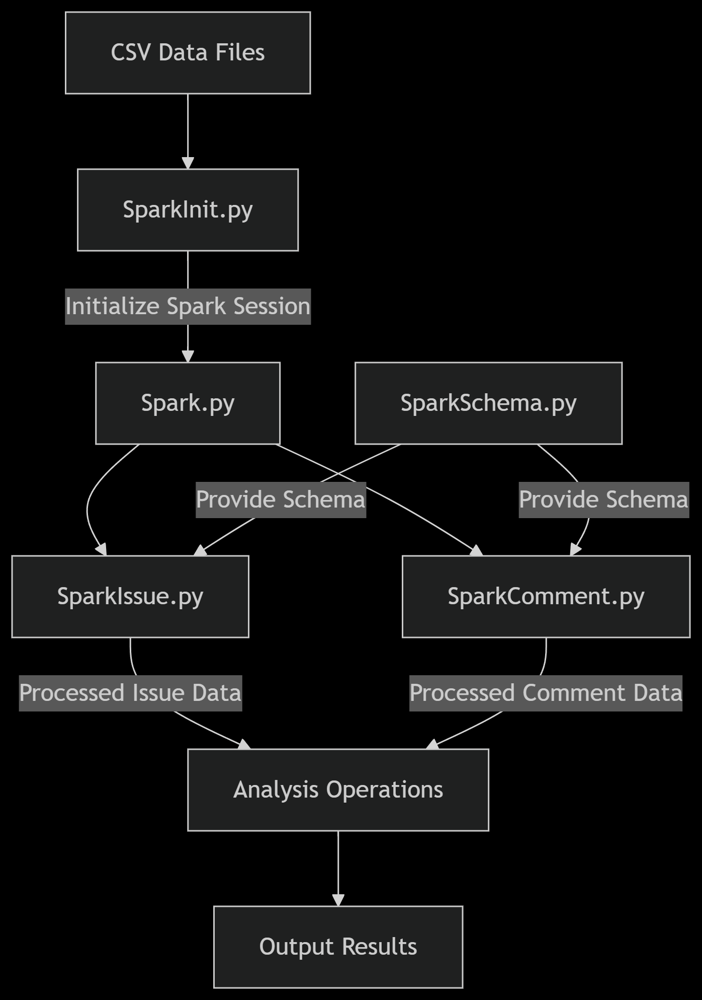

# GitHub Data Scraper and Analyzer

## Overview

This project scrapes GitHub issues and comments, then performs Spark analysis on the collected data. The system provides a menu-driven interface for easy operation.

## Installation

1. Clone this repository
2. Install dependencies:

```bash
pip install -r requirements.txt
```

## Usage

Run the application:

```bash
python -B main.py
```

### Menu Options

1. **Scrape GitHub Issues & Comments Data**: Collects issue and comment data from GitHub repositories
2. **Spark Analysis**: Performs data analysis on collected GitHub data using PySpark
3. **Exit**: Quits the application

## Output Reports

- **Scraping Report**: [Detailed statistics and logs](document/de_expsc_assessment_scrape_result.md) from the GitHub data collection process
- **Analysis Report**: [Comprehensive results](document/de_expsc_assessment_spark_result.md) of the Spark data analysis
- **SQL Queries**: Implementation of [`average_resolution_by_month.sql`](https://github.com/makenaichu970413/exp-science-de-assessment/blob/main/sql/average_resolution_by_month.sql) used in Spark analysis

## Scrape Data


The scraping process involves:

1. **Initialization**:

   - Database tables initialized for logging
   - Repository URLs loaded from Excel/DB

2. **Repository Processing**:

   - Each repository marked as PROCESS before scraping
   - Loop continues until all repositories are processed

3. **Issue Scraping**:

   - Checks temporary storage for existing page data
   - Calls GitHub API with retry logic (max 3 attempts)
   - Saves raw data to temporary storage
   - Exports clean data to CSV

4. **Comment Scraping**:

   - Filters issues with comments
   - Scrapes comments only for `PENDING`/`PROCESS`/`FAILED` issues
   - Similar retry logic and temp storage as issue scraping

5. **Status Tracking & Reporting**:
   - Repository status updated to `COMPLETE` after success
   - Detailed error logging for failed scrapes
   - [Final report generated with statistics](document/de_expsc_assessment_scrape_result.md)

## Spark Analysis



The Spark analysis process involves:

1. **Data Ingestion**:

   - Raw CSV files loaded into Spark DataFrames
   - Schema validation applied during ingestion

2. **Schema Application**:

   - Predefined schemas from `SparkSchema.py` structure the data
   - Complex nested structures (users, reactions, milestones) are properly typed

3. **Data Processing**:

   - **GitHub Issues**: Processed in `SparkIssue.py`
     - Nested structures (assignees, labels) flattened
     - Milestone data extracted
   - **GitHub Comments**: Processed in `SparkComment.py`
     - User information enriched
     - Reaction metrics calculated

4. **Analysis Operations**:

   - Coordinated by `Spark.py`
   - Joins issue and comment datasets
   - Performs aggregations (comment counts, reaction metrics)
   - Generates repository health metrics

5. **Result Output**:
   - [Summary of statistical results and visualizations generated](document/de_expsc_assessment_spark_result.md)

## Features

- **GitHub Data Scraping**: Automated collection of issues and comments with retry mechanism
- **Data Validation**: Robust validation using `Pydantic` models to ensure data quality
- **Spark Data Analysis**: Advanced processing of GitHub data including nested structure handling
- **Menu-Driven Interface**: User-friendly console interface for easy operation
- **Data Persistence**: Flexible storage options (CSV, JSON, SQLite)
- **Workflow Visualization**: Mermaid diagrams documenting data flows
- **Error Handling**: Comprehensive logging and status tracking
- **Reporting**: Automated report generation for scraping and analysis results
