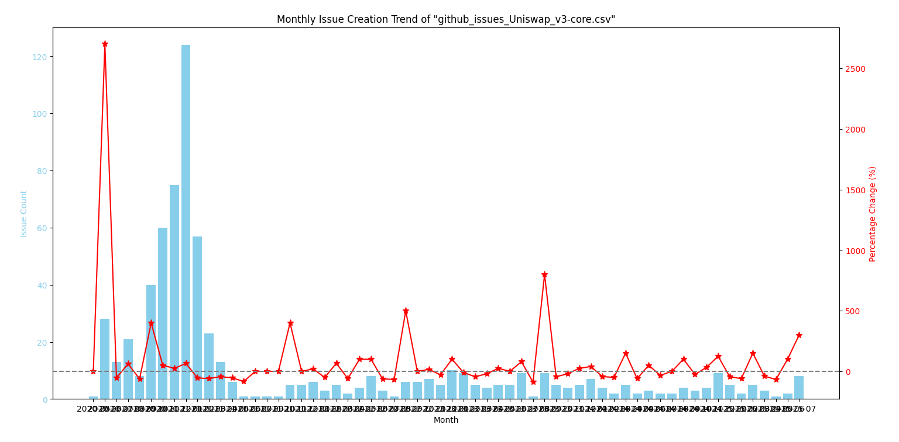

### ✨ Top 10 commenters

**Total "10" records**

```shell
+--------+-----+
|id      |count|
+--------+-----+
|7897876 |179  |
|3760414 |99   |
|26384082|52   |
|1187252 |17   |
|9343483 |12   |
|17802178|10   |
|799573  |10   |
|40770586|9    |
|95510084|9    |
|5619220 |7    |
+--------+-----+
```

### ✨ Average resolution time by month

**Total "59" records**

```shell
+-------+-------------------+
|month  |avg_resolution_days|
+-------+-------------------+
|2020-05|35.0               |
|2020-06|52.79              |
|2020-07|41.77              |
|2020-08|39.33              |
|2020-09|25.25              |
|2020-10|6.45               |
|2020-11|7.22               |
|2020-12|8.37               |
|2021-01|2.66               |
|2021-02|2.93               |
|2021-03|1.83               |
|2021-04|1.23               |
|2021-05|4.6                |
|2021-07|20.0               |
|2021-09|0.0                |
|2021-10|0.0                |
|2021-11|1.0                |
|2021-12|27.25              |
|2022-01|6.67               |
|2022-02|26.0               |
|2022-03|12.75              |
|2022-04|23.0               |
|2022-05|24.0               |
|2022-06|25.75              |
|2022-07|0.0                |
|2022-08|0.0                |
|2022-09|3.5                |
|2022-10|30.0               |
|2022-11|12.8               |
|2022-12|53.0               |
|2023-01|35.33              |
|2023-02|43.86              |
|2023-03|29.25              |
|2023-04|100.0              |
|2023-05|40.0               |
|2023-06|106.0              |
|2023-07|106.71             |
|2023-09|60.38              |
|2023-10|64.0               |
|2023-11|80.33              |
|2023-12|0.0                |
|2024-01|90.0               |
|2024-02|150.0              |
|2024-03|121.0              |
|2024-04|47.33              |
|2024-05|119.5              |
|2024-06|16.0               |
|2024-07|0.0                |
|2024-08|79.0               |
|2024-09|34.5               |
|2024-10|183.0              |
|2024-11|41.5               |
|2024-12|70.67              |
|2025-01|2.0                |
|2025-02|98.0               |
|2025-03|58.33              |
|2025-04|33.5               |
|2025-06|0.0                |
|2025-07|0.0                |
+-------+-------------------+
```

### ✨ SQL Query : Average resolution time by month

**Total "59" records**

```shell
+-------+-------------------+
|month  |avg_resolution_days|
+-------+-------------------+
|2020-05|35.0               |
|2020-06|52.79              |
|2020-07|41.77              |
|2020-08|39.33              |
|2020-09|25.25              |
|2020-10|6.45               |
|2020-11|7.22               |
|2020-12|8.37               |
|2021-01|2.66               |
|2021-02|2.93               |
|2021-03|1.83               |
|2021-04|1.23               |
|2021-05|4.6                |
|2021-07|20.0               |
|2021-09|0.0                |
|2021-10|0.0                |
|2021-11|1.0                |
|2021-12|27.25              |
|2022-01|6.67               |
|2022-02|26.0               |
|2022-03|12.75              |
|2022-04|23.0               |
|2022-05|24.0               |
|2022-06|25.75              |
|2022-07|0.0                |
|2022-08|0.0                |
|2022-09|3.5                |
|2022-10|30.0               |
|2022-11|12.8               |
|2022-12|53.0               |
|2023-01|35.33              |
|2023-02|43.86              |
|2023-03|29.25              |
|2023-04|100.0              |
|2023-05|40.0               |
|2023-06|106.0              |
|2023-07|106.71             |
|2023-09|60.38              |
|2023-10|64.0               |
|2023-11|80.33              |
|2023-12|0.0                |
|2024-01|90.0               |
|2024-02|150.0              |
|2024-03|121.0              |
|2024-04|47.33              |
|2024-05|119.5              |
|2024-06|16.0               |
|2024-07|0.0                |
|2024-08|79.0               |
|2024-09|34.5               |
|2024-10|183.0              |
|2024-11|41.5               |
|2024-12|70.67              |
|2025-01|2.0                |
|2025-02|98.0               |
|2025-03|58.33              |
|2025-04|33.5               |
|2025-06|0.0                |
|2025-07|0.0                |
+-------+-------------------+
```

#### SQL Query

[Implementation in `sql/average_resolution_by_month.sql`](https://github.com/makenaichu970413/exp-science-de-assessment/blob/main/sql/average_resolution_by_month.sql)

```sql
        SELECT
            DATE_FORMAT(created_at, 'yyyy-MM') AS month,
            ROUND(AVG(DATEDIFF(closed_at, created_at)), 2) AS avg_resolution_days
        FROM issues
        WHERE state = 'closed'
        GROUP BY month
        ORDER BY month
```

### ✨ Monthly issue creation trend



```
+-------+-----+----------+-----------------+
|month  |count|prev_count|percentage_change|
+-------+-----+----------+-----------------+
|2020-05|1    |0         |0.0              |
|2020-06|28   |1         |2700.0           |
|2020-07|13   |28        |-53.57           |
|2020-08|21   |13        |61.54            |
|2020-09|8    |21        |-61.9            |
|2020-10|40   |8         |400.0            |
|2020-11|60   |40        |50.0             |
|2020-12|75   |60        |25.0             |
|2021-01|124  |75        |65.33            |
|2021-02|57   |124       |-54.03           |
|2021-03|23   |57        |-59.65           |
|2021-04|13   |23        |-43.48           |
|2021-05|6    |13        |-53.85           |
|2021-06|1    |6         |-83.33           |
|2021-07|1    |1         |0.0              |
|2021-09|1    |1         |0.0              |
|2021-10|1    |1         |0.0              |
|2021-11|5    |1         |400.0            |
|2021-12|5    |5         |0.0              |
|2022-01|6    |5         |20.0             |
|2022-02|3    |6         |-50.0            |
|2022-03|5    |3         |66.67            |
|2022-04|2    |5         |-60.0            |
|2022-05|4    |2         |100.0            |
|2022-06|8    |4         |100.0            |
|2022-07|3    |8         |-62.5            |
|2022-08|1    |3         |-66.67           |
|2022-09|6    |1         |500.0            |
|2022-10|6    |6         |0.0              |
|2022-11|7    |6         |16.67            |
|2022-12|5    |7         |-28.57           |
|2023-01|10   |5         |100.0            |
|2023-02|9    |10        |-10.0            |
|2023-03|5    |9         |-44.44           |
|2023-04|4    |5         |-20.0            |
|2023-05|5    |4         |25.0             |
|2023-06|5    |5         |0.0              |
|2023-07|9    |5         |80.0             |
|2023-08|1    |9         |-88.89           |
|2023-09|9    |1         |800.0            |
|2023-10|5    |9         |-44.44           |
|2023-11|4    |5         |-20.0            |
|2023-12|5    |4         |25.0             |
|2024-01|7    |5         |40.0             |
|2024-02|4    |7         |-42.86           |
|2024-03|2    |4         |-50.0            |
|2024-04|5    |2         |150.0            |
|2024-05|2    |5         |-60.0            |
|2024-06|3    |2         |50.0             |
|2024-07|2    |3         |-33.33           |
|2024-08|2    |2         |0.0              |
|2024-09|4    |2         |100.0            |
|2024-10|3    |4         |-25.0            |
|2024-11|4    |3         |33.33            |
|2024-12|9    |4         |125.0            |
|2025-01|5    |9         |-44.44           |
|2025-02|2    |5         |-60.0            |
|2025-03|5    |2         |150.0            |
|2025-04|3    |5         |-40.0            |
|2024-03|2    |4         |-50.0            |
|2024-04|5    |2         |150.0            |
|2024-05|2    |5         |-60.0            |
|2024-06|3    |2         |50.0             |
|2024-07|2    |3         |-33.33           |
|2024-08|2    |2         |0.0              |
|2024-09|4    |2         |100.0            |
|2024-10|3    |4         |-25.0            |
|2024-11|4    |3         |33.33            |
|2024-12|9    |4         |125.0            |
|2025-01|5    |9         |-44.44           |
|2025-02|2    |5         |-60.0            |
|2025-03|5    |2         |150.0            |
|2025-04|3    |5         |-40.0            |
|2024-04|5    |2         |150.0            |
|2024-05|2    |5         |-60.0            |
|2024-06|3    |2         |50.0             |
|2024-07|2    |3         |-33.33           |
|2024-08|2    |2         |0.0              |
|2024-09|4    |2         |100.0            |
|2024-10|3    |4         |-25.0            |
|2024-11|4    |3         |33.33            |
|2024-12|9    |4         |125.0            |
|2025-01|5    |9         |-44.44           |
|2025-02|2    |5         |-60.0            |
|2025-03|5    |2         |150.0            |
|2025-04|3    |5         |-40.0            |
|2024-10|3    |4         |-25.0            |
|2024-11|4    |3         |33.33            |
|2024-12|9    |4         |125.0            |
|2025-01|5    |9         |-44.44           |
|2025-02|2    |5         |-60.0            |
|2025-03|5    |2         |150.0            |
|2025-04|3    |5         |-40.0            |
|2024-12|9    |4         |125.0            |
|2025-01|5    |9         |-44.44           |
|2025-02|2    |5         |-60.0            |
|2025-03|5    |2         |150.0            |
|2025-04|3    |5         |-40.0            |
|2025-01|5    |9         |-44.44           |
|2025-02|2    |5         |-60.0            |
|2025-03|5    |2         |150.0            |
|2025-04|3    |5         |-40.0            |
|2025-03|5    |2         |150.0            |
|2025-04|3    |5         |-40.0            |
|2025-05|1    |3         |-66.67           |
|2025-04|3    |5         |-40.0            |
|2025-05|1    |3         |-66.67           |
|2025-05|1    |3         |-66.67           |
|2025-06|2    |1         |100.0            |
|2025-07|8    |2         |300.0            |
+-------+-----+----------+-----------------+
